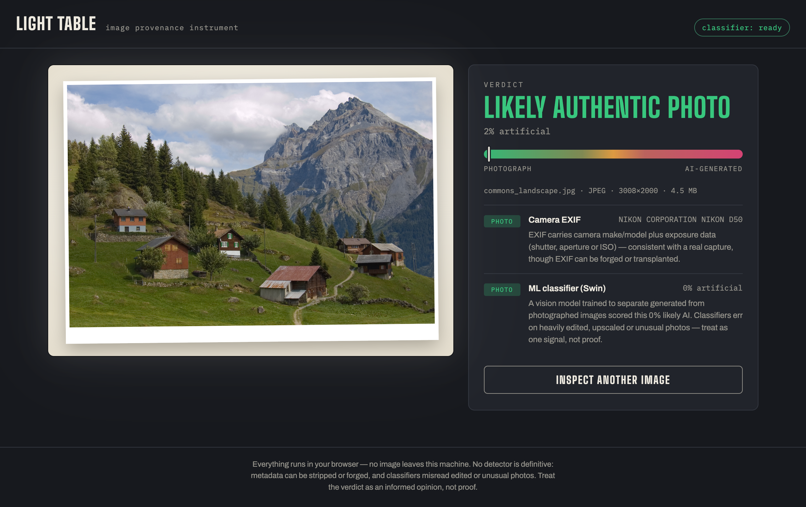
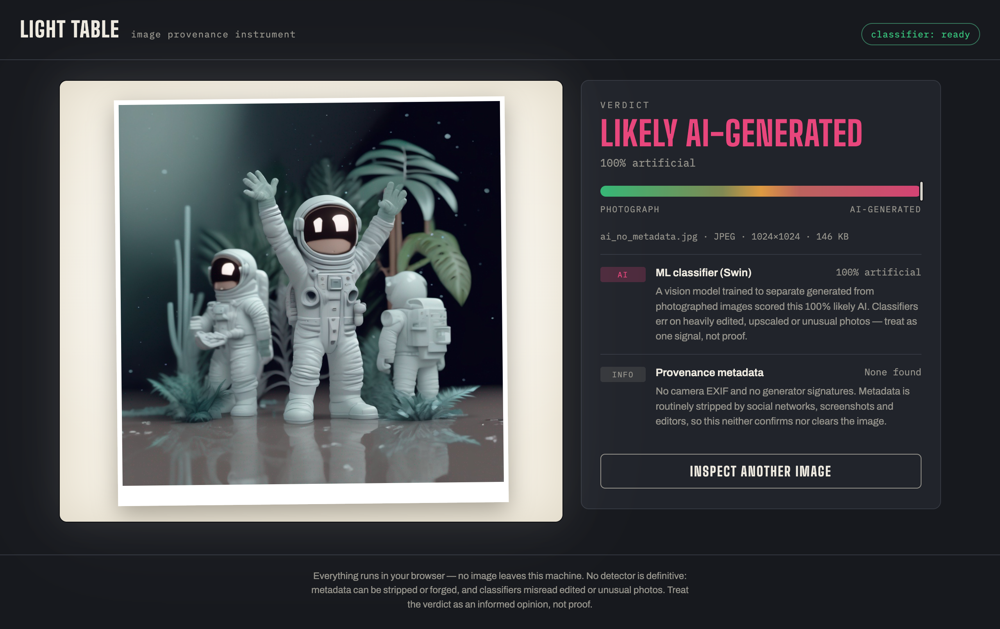

# Report — Light Table

## 1. What did you build?

**Light Table** — a web app that judges whether an image is AI-generated or an
authentic photo. Repo: https://github.com/dik-garri/detector

Drop an image on the "light table" and it combines two signals into a verdict
with an evidence report: **metadata forensics** (Stable Diffusion/ComfyUI
recipes in PNG chunks, camera EXIF, the IPTC `trainedAlgorithmicMedia` marker
used by DALL-E, C2PA credentials) and an **in-browser ML classifier** (Swin
transformer via transformers.js, quantized ONNX). Everything runs client-side —
no backend, no API keys, no image leaves the machine.

| Real photo | AI image (SDXL, metadata stripped) |
|---|---|
|  |  |

## 2. What did you learn?

- **Metadata is the strongest and weakest signal at once** — an embedded
  generation recipe is near-proof, but social networks strip it, so most
  real-world images fall to the classifier. Layered scoring (hard evidence
  overrides, soft evidence nudges) handles both.
- **In-browser ML is practical now** — an 88 MB quantized model loads once,
  caches, and classifies in under a second, with privacy for free.
- **No detector is definitive** — metadata can be forged and classifiers
  misread edited photos, so the UI shows an evidence trail, not a binary
  answer.
